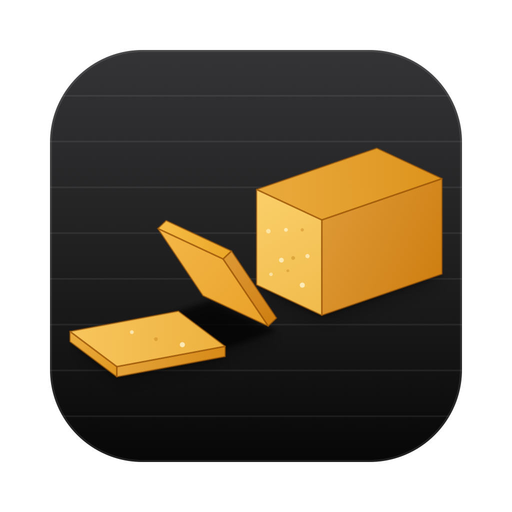
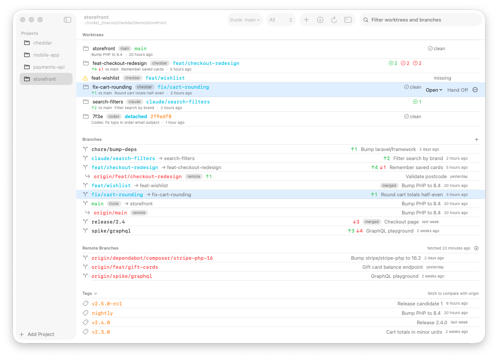
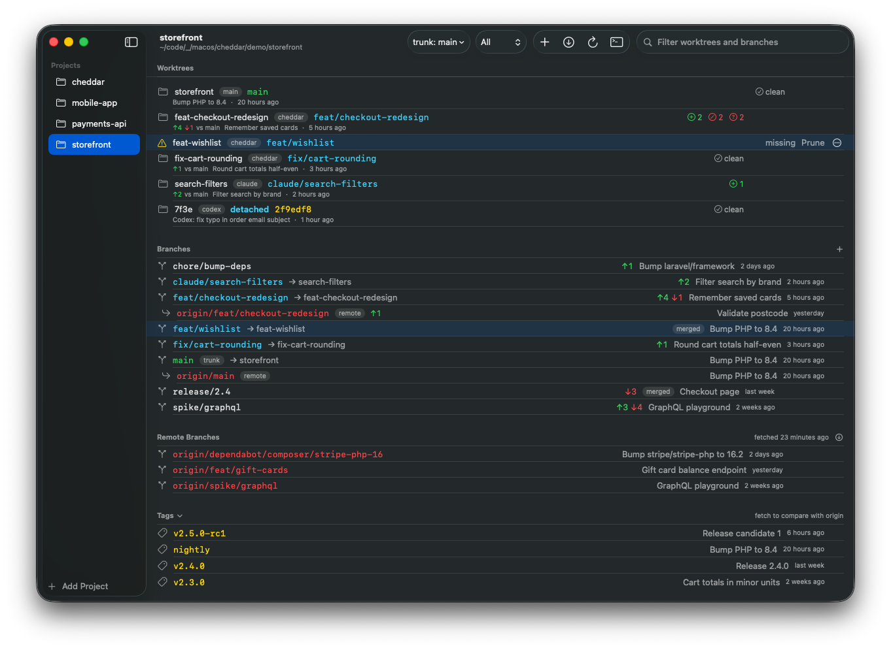
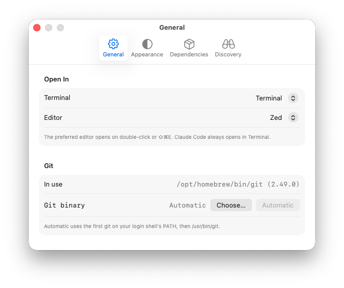
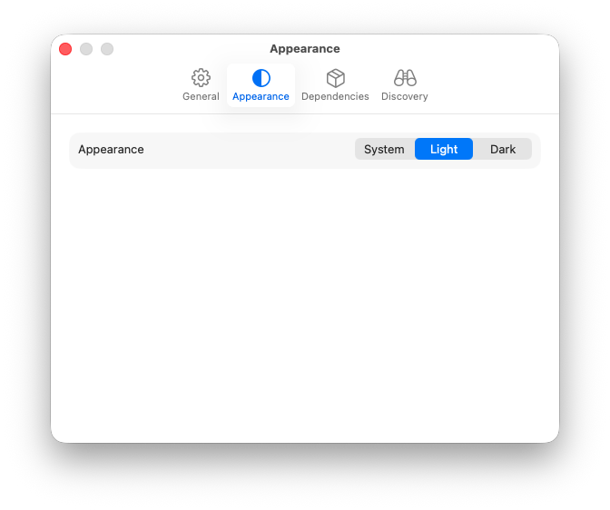
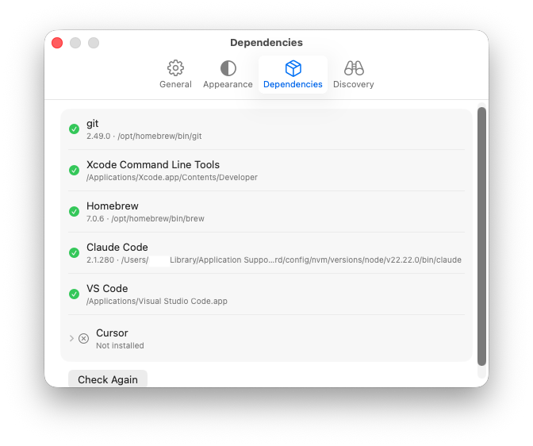
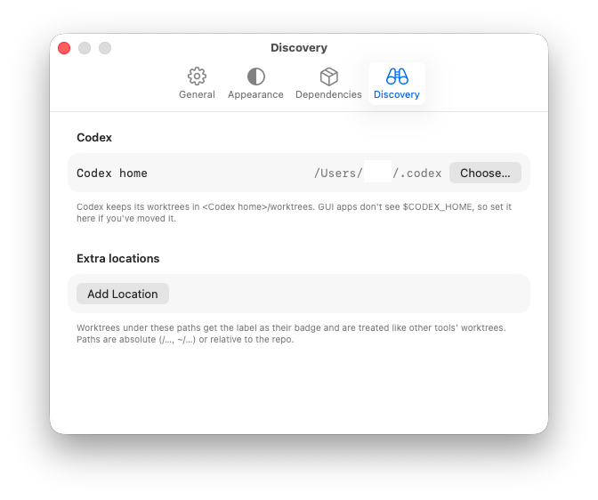

<p align="center">
  
</p>
<h1 align="center">Cheddar</h1>

A small native macOS app for managing **git worktrees** and **branches**. It shows every worktree of a repo, including ones made by Claude Code, Codex and other tools, and lets you create, rename, delete and hand off worktrees and branches. It runs locally only: no App Store, no notarization, no Apple developer account. Build it yourself.

## Requirements

- macOS 14 or later
- Xcode (to build)
- [XcodeGen](https://github.com/yonaskolb/XcodeGen), which generates the Xcode project from `project.yml`
- git 2.36 or later at runtime. If it's missing, Cheddar shows a Setup screen with install steps.

## Build

```sh
brew install xcodegen
xcodegen generate
xcodebuild -scheme Cheddar -configuration Release -derivedDataPath build build
```

The app is written to `build/Build/Products/Release/Cheddar.app`. To work in Xcode instead, run `open Cheddar.xcodeproj`. Signing is "Sign to Run Locally" (no team needed).

On a fresh Xcode install, first run the following. Homebrew and `xcodebuild` refuse to run until the license is accepted.

```sh
sudo xcodebuild -license accept
xcodebuild -runFirstLaunch
```

`Cheddar.xcodeproj` is generated and gitignored. Re-run `xcodegen generate` after adding or removing source files, or after editing `project.yml`.

## Install

```sh
ditto build/Build/Products/Release/Cheddar.app /Applications/Cheddar.app
```

To update, quit Cheddar, rebuild, and run the same command again. Your projects and settings are kept.

## Test

```sh
xcodebuild -scheme Cheddar test
```

The git tests create throwaway repos in a temp folder and run real git commands.

Testing also builds a Debug copy of the app, which you can launch to try a change without a Release build or install. It goes to Xcode's DerivedData folder, whose path differs per machine; `xcodebuild` prints it:

```sh
open "$(xcodebuild -scheme Cheddar -showBuildSettings 2>/dev/null | awk -F' = ' '/ BUILT_PRODUCTS_DIR /{print $2}')/Cheddar.app"
```

Quit any other copy of Cheddar first: both share an app ID, so `open` may just bring the running one to the front. The Debug copy uses the same projects and settings.

## Demo repos

```sh
scripts/make-demo.sh
```

This creates three repos in `demo/` (gitignored) with worktrees and branches in every state Cheddar shows: dirty and conflicted worktrees, ahead/behind, merged and gone branches, missing, orphaned, locked and external worktrees, remote branches, and tags in every state (click Fetch to compare them with the demo's origin). It's handy for screenshots. Add them with **+ Add Project**. Running the script again rebuilds them from scratch.

## App icon

The icon art is in `Design/`. The SVGs are generated by `Design/icon.py`; edit that and regenerate everything with:

```sh
python3 Design/icon.py
sips -s format png Design/AppIcon.svg --out Design/AppIcon-1024.png
sips -s format png Design/AppIcon-small.svg --out Design/AppIcon-small.png
scripts/make-icons.sh
```

## Good to know

- **Where data lives:**
  - The project list is in `~/Library/Application Support/Cheddar/projects.json`.
  - Settings are stored under the app ID `com.breadthe.Cheddar`.
- **Worktree folders:** Cheddar's own worktrees go in `<repo>/.cheddar/worktrees/`, and Cheddar adds `.cheddar/` to `.git/info/exclude`.
- **First run of "Claude Code Here":** macOS asks whether Cheddar may control Terminal. You can change that later in System Settings → Privacy & Security → Automation.
- **App Sandbox is off,** because the sandbox blocks running git on arbitrary folders.

## Screenshots

**Light mode**

<picture>
  
</picture>

**Dark mode**

<picture>
  
</picture>

| General | Appearance |
|---|---|
|  |  |
| **Dependencies** | **Discovery** |
|  |  |

## License

[MIT](LICENSE)
